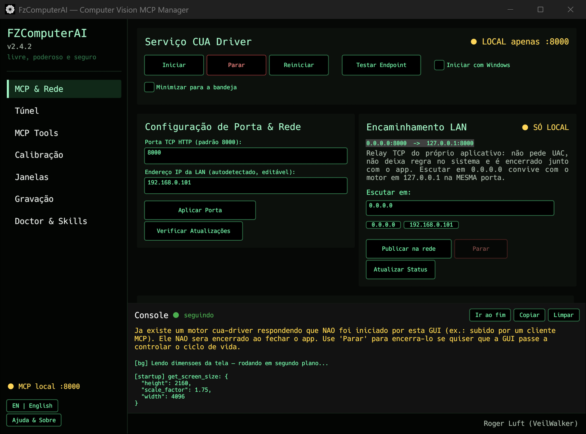
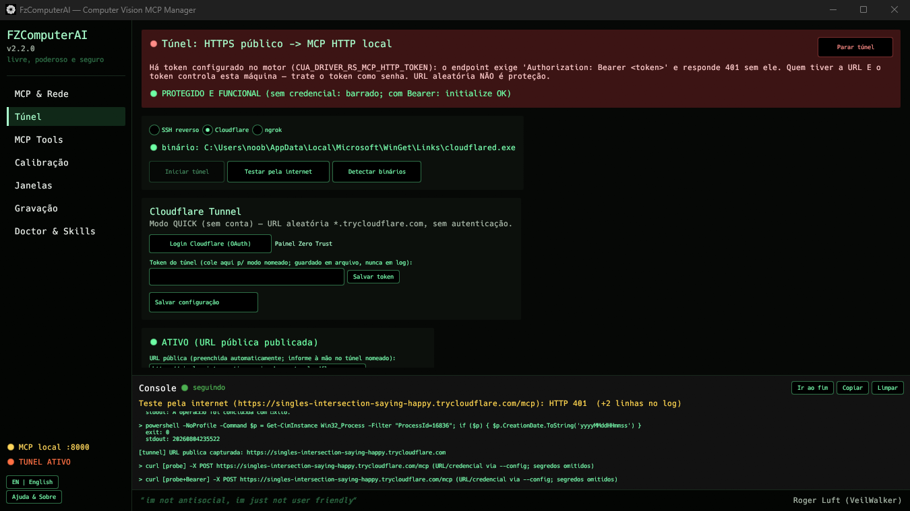
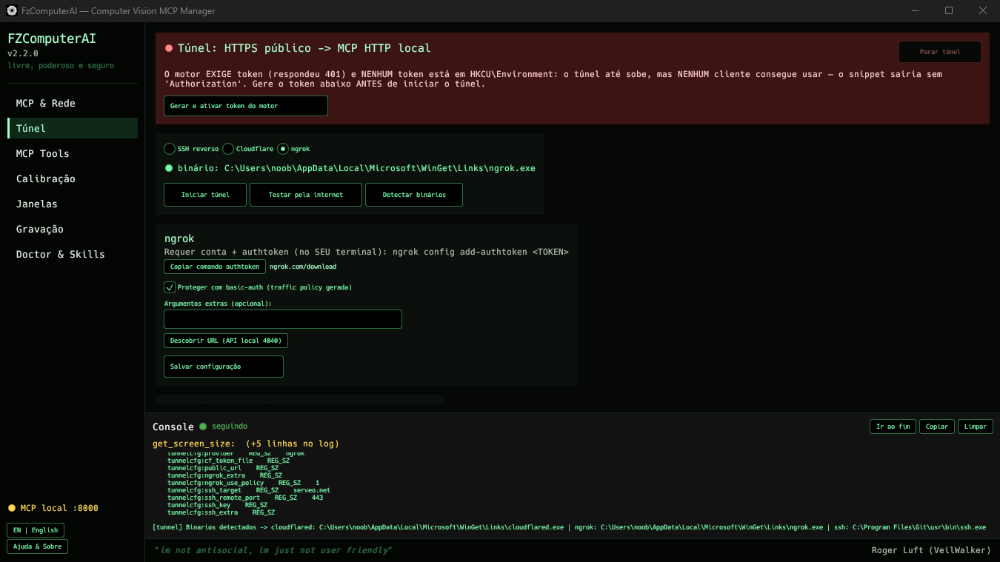
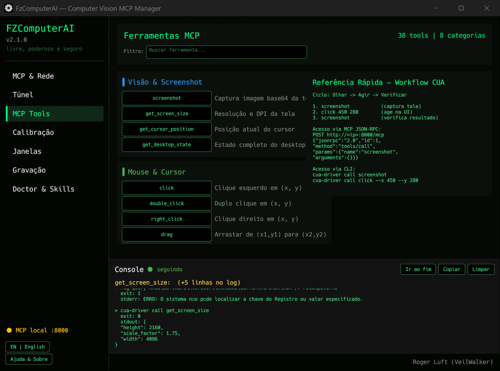

# FzComputerAI — Computer Vision via Model Context Protocol (MCP)

<div align="center">


[](https://github.com/sponsors/RLuf)

<p align="center">
  <strong>Native Multimodal Computer Vision & Desktop Automation Server for AI Agents</strong>
</p>

[Português (BR)](README.md) | [English (US)](README_EN.md)

</div>

---

> **FzComputerAI** is the **native graphical interface** that manages a **Computer Vision and UI Automation** server accessible via the **Model Context Protocol (MCP)**. It lets AI Agents (Claude Code, Antigravity, FazAI-NG, Cursor, Windsurf, local LLMs) see the screen and operate any desktop application — and it handles the tedious part: starting the engine, configuring the port, proving the endpoint really answers, and publishing access over the LAN or the internet safely.
>
> The automation engine is **`cua-driver`**, from the open-source [**Cua**](https://github.com/trycua/cua) project (MIT, Cua AI, Inc.). FzComputerAI **does not replace the engine** — it is the cockpit for it.

---

## 🖼️ The tool

<div align="center">

**MCP & Network** — engine control, port, forwarding and diagnostics with **real** state (nothing assumed)



**Tunnel (Internet)** — publishes the local MCP on an HTTPS URL via Cloudflare, ngrok or reverse SSH, with a **2-phase** exposure probe (without and with Bearer) and the end-to-end verified **PROTECTED AND FUNCTIONAL** verdict



**Engine token** — `cua-driver` engines 0.16+ require a Bearer token and are *fail-closed* without it (401 for everything); the tab warns in red and the **"Generate and activate engine token"** button generates, stores and restarts the daemon in one click



**MCP Tools** — catalog of the engine's tools, with filtering and one-click execution



</div>

---

## ✨ What the interface delivers

| Feature | What it does |
| :--- | :--- |
| **Engine lifecycle** | Start, stop and restart `cua-driver` in one click. The Windows autostart is the **GUI’s** (launch the app with the system) - the engine uses no scheduled task. On launch the app brings the engine up itself **as a child process** (if nothing is answering on the port); on exit, the engine it started is shut down and temporary configuration undone. |
| **Honest status** | Nothing is assumed: the check is a real JSON-RPC `POST initialize`, and the LAN green badge only appears with a listener confirmed in `netstat` **and** the endpoint answering. |
| **LAN access** | A TCP relay inside the app itself: it listens on `0.0.0.0:<port>` (or on an IP you pick in the *Listen on* field) and forwards to the engine's `127.0.0.1:<port>`, copying bytes both ways without inspecting HTTP — keep-alive and SSE pass through intact. It **does not ask for UAC**, leaves no rule behind on the system, and dies together with the app. Badge **PUBLISHED ON THE NETWORK / LOCAL ONLY** with a real connection counter (active/total). **Legacy** `netsh portproxy` rules can still be removed — the button only shows up when one exists. |
| **Internet access** | **Tunnel** tab: Cloudflare Tunnel (quick, no account, or named with your own domain), ngrok and reverse SSH. **Outbound** tunnel — no router port forwarding required. The public-URL test runs in the background: the interface does not freeze while it happens. |
| **Your own domain (fixed URL)** | Full flow through the GUI for the named Cloudflare tunnel: **Login** (OAuth in the browser) → **Verify login** (really checks whether `cert.pem` exists) → **Create tunnel + point DNS** → **Start tunnel**. The login alone creates nothing — it only downloads the certificate; that is why the two extra steps exist. The domain must already be in your Cloudflare account (nameservers delegated). |
| **URL password** | Level-1 authentication through a local gate: the URL becomes `https://…/s/<password>/mcp`, and without the password requests get a 404. |
| **The URL alone is enough** | Clients that only accept **a URL** (Claude Desktop, for instance) have nowhere to paste the `Authorization` header. Whoever proved the password in the path is already authenticated as far as the app is concerned, so the gate adds the `Bearer` when talking to the engine — and if the client sends its own `Authorization`, the client's wins. The engine secret never travels over the internet; the public credential becomes the password in the URL. |
| **Exposure probe** | Tests the **public URL** in **2 phases**: first without credentials (exposed, blocked by the engine, blocked at the edge, or not verifiable); then, if the GUI knows the engine token, it repeats **with** `Authorization: Bearer` — blocked without credentials **and** `initialize` OK with Bearer yields the **PROTECTED AND FUNCTIONAL** verdict. |
| **Engine token** | `cua-driver` engines 0.16+ require a Bearer token on the `/mcp` endpoint (no token configured: *fail-closed*, 401 for everything). The GUI generates the token (CSPRNG), stores it in `HKCU\Environment` without logging the value, restarts the daemon, and the `mcpServers` snippet already ships with the `Authorization` header. |
| **Everything dies with the app** | Engine and tunnel are **child processes** adopted into a Windows **Job Object**: the kernel is what terminates them, together with the GUI — closing on the X, *Exit* from the tray, a `taskkill /F`, a crash or a logoff (verified). A third-party engine already answering on the port is detected, **not** duplicated and **not** killed, and the interface says it will not be closed along with the app. The tunnel watchdog remains as a *fallback*, in case the Job adoption fails. |
| **Update Center** | Checks and updates **two** components: this interface (installer with verified SHA256) and the **engine** (through its own official API, `check-update` / `update --apply`). |
| **MCP Tools catalog** | List, filter and run the vision and automation tools without leaving the interface. |
| **Single console** | One global console at the bottom, visible in every section, scrolling like `tail -f`: it follows on its own and pauses when you scroll up to read. |
| **Bilingual and native** | PT-BR / English in real time. Rust + `egui`, no Chromium, no WebView, no Node runtime. |

---

## 💎 Sponsors & Support

<div align="center">

| Sponsor | Website | Focus |
| :--- | :--- | :--- |
| **Webstorage Tecnologia** | [www.webstorage.com.br](https://www.webstorage.com.br) | Infrastructure Solutions, Cloud & Intelligent Automation |
| **Imóvel Site** | [www.imovelsite.com.br](https://www.imovelsite.com.br) | Real Estate Management & PropTech Platform |

</div>

---

## 🚀 Key Features (Computer Vision via MCP)

The server exposes a standardized set of MCP tools (*MCP Tools*) for multimodal computer vision analysis and desktop control:

### 👁️ Vision & Visual Inspection

| MCP Tool | Description |
|---|---|
| `get_desktop_state` | Captures the desktop image (Computer Vision), lists active windows and the cursor state. |
| `get_window_state` | Focused capture of a specific window + accessibility tree (UIA) with clickable element tokens. |
| `zoom` | Magnifies a window region for fine inspection; zoom coordinates can be used in clicks (`from_zoom`). |
| `get_accessibility_tree` | Extracts the full accessibility tree for semantic navigation. |

### 🖱️ Pointer Actions & Automation

| MCP Tool | Description |
|---|---|
| `click` / `double_click` / `right_click` | Clicks by element token (UIA, works in the background) or by screenshot pixel. |
| `move_cursor` | Moves the cursor to window or desktop positions. |
| `drag` | Drag and drop with controlled trajectory. |
| `scroll` | Vertical/horizontal scrolling on the target window. |

### ⌨️ Keyboard & Shortcuts

| MCP Tool | Description |
|---|---|
| `type_text` | Types text (Unicode/international accentuation supported), including in the background via UIA. |
| `press_key` | Sends individual keys (e.g., `Enter`, `Tab`, `Escape`). |
| `hotkey` | Triggers combinations (e.g., `Ctrl+C`, `Ctrl+V`, `Alt+Tab`). |

### 🛠️ Application Management & Recording

| MCP Tool | Description |
|---|---|
| `launch_app` / `kill_app` / `list_apps` | Launches, terminates and lists applications. |
| `list_windows` / `bring_to_front` / `set_window_frame` | Enumerates windows, raises them and sets exact geometry with real readback. |
| `start_recording` / `stop_recording` / `replay_trajectory` | Records the session and replays recorded trajectories. |
| `verify_state` | Deterministically verifies postconditions (success is never assumed). |

---

## 🖥️ Native GUI (Rust `fzcomputerai v2.4.2`)

Native Rust GUI (`egui`/`eframe`, no Chromium or WebView), bilingual **PT-BR / English** with real-time language toggle. Organized into **7 tabs**:

| Tab | Purpose |
| :--- | :--- |
| **MCP & Network** | MCP server HTTP port configuration (`CUA_DRIVER_RS_MCP_HTTP_PORT`), **publishing on the local network through the built-in TCP relay** (*Publish on the network* / *Stop* buttons, no UAC and no rule left on the system), real `/mcp` endpoint test over TCP, network URL with auto-detected LAN IP, **Check for Updates** button (GitHub Releases auto-installer), **Start with Windows** (autostart) option, and deduplicated **Debug Console** with auto-scroll. |
| **MCP Tools** | **[NEW v2.0.0]** Interactive visual catalog to list, filter by category, and run any MCP vision & automation tool directly. |
| **Tunnel (Internet)** | **[NEW v2.1.0]** Exposes the local MCP HTTP endpoint to the internet (public HTTPS -> local HTTP) via **Cloudflare Tunnel** (quick + named, OAuth login/token), **ngrok**, and **reverse SSH** (own server or localhost.run/serveo). Captures the public URL, builds the `mcpServers` snippet, and truly tests the public URL with a **2-phase exposure probe** (`POST initialize` without and with Bearer; **PROTECTED AND FUNCTIONAL** verdict when the credential-less request is blocked and the Bearer one answers). **[NEW v2.2.0]** `cua-driver` engines 0.16+ require a **Bearer token** on `/mcp` (*fail-closed* without it): the tab warns and the **"Generate and activate engine token"** button generates, stores and restarts in one click — the snippet already ships with `Authorization`. The **URL password** through a local gate (`/s/<password>/mcp`) remains an optional layer, compatible with the Bearer (the password travels in the path, not in the header). Clean lifecycle: the tunnel never outlives the app. **[NEW v2.4.0]** Cloudflare with **your own domain** (fixed URL) through GUI-guided steps — *Login*, *Verify login*, *Create tunnel + point DNS* and *Start tunnel* — and the gate now **injects the `Authorization: Bearer`** when talking to the engine, so clients that only accept a URL work with no header at all (if the client sends its own `Authorization`, the client's wins). The exposure probe runs in the background: the interface no longer freezes while it happens. **Old engines (≤0.8.x) have no authentication of their own — read the tab's warning.** |
| **Calibration & Vision** | Screen calibration, DPI scaling, and coordinate click testing. |
| **Windows & Apps** | Active window listing, UIA inspection, and application launching. |
| **Recording Trajectory** | Start and stop session/trajectory recordings. |
| **Doctor & Skills** | Health diagnostics (`doctor`) and skill install/update/uninstall. |

v2.0.0 Stable Highlights:
- **MCP Tools Catalog**: run CLI calls for computer vision and automation tools directly from the GUI.
- **Smart Auto-Upgrade**: direct GitHub Releases check with background download and automatic installation.
- **Formatted Debug Console**: organized logs with 2 blank lines spacing and auto-scroll to bottom.
- **Installer with Auto-Cleanup**: terminates legacy processes and removes stale Registry keys before fresh installation.

---

## 🛠️ System Architecture & Connection Modes

```
  ┌────────────────────────────────────────────────────────────────────────┐
  │                   AI Agent / Remote Orchestrator                       │
  │        (Antigravity / FazAI-NG / Claude Code / Cursor / Windsurf)       │
  └───────────────────────────────────┬────────────────────────────────────┘
                                      │
           ┌──────────────────────────┴──────────────────────────┐
           │ Stdio Mode (Local)       │ HTTP TCP/IP Mode (:8000) │
           ▼                          ▼                          ▼
  ┌────────────────────────────────────────────────────────────────────────┐
  │               FzComputerAI — MCP Computer Vision Server                │
  │                           (cua-driver engine)                          │
  ├────────────────────────────────────┬───────────────────────────────────┤
  │       Screen Capture (WGC/DX)      │    Input Injection (SendInput)    │
  └────────────────────────────────────┴───────────────────────────────────┘
```

---

## 🌐 Remote Connection via HTTP TCP/IP (Orchestrators like FazAI-NG)

In addition to local `stdio` mode, the server supports remote connections via the **HTTP TCP/IP** protocol. This allows an orchestrator running on a separate server (e.g. Linux) to control desktop machines over the network:

### Enabling the HTTP Port on the Server (Windows):
```powershell
# Set TCP port 8000 for the MCP server
[Environment]::SetEnvironmentVariable('CUA_DRIVER_RS_MCP_HTTP_PORT', '8000', 'User')
# After this, just OPEN FzComputerAI: it starts the engine as a child
# process (and stops it on exit). Do NOT use `cua-driver autostart kick` -
# the scheduled task was removed from the app flow in v2.3.0.
```

> **Heads-up (verified):** the engine listens **only on `127.0.0.1`** — setting the port does NOT publish anything on the LAN.
> For another machine to reach the endpoint, use **Publish on the network** (the app's own TCP relay, no UAC and no rule left on the system) on the *MCP & Network* tab, or the **Tunnel** tab.
> Engines **0.16+** additionally require the `Authorization: Bearer <token>` header (token from `CUA_DRIVER_RS_MCP_HTTP_TOKEN`;
> the Tunnel tab generates and stores it for you) and **reject requests with a browser `Origin`** (HTTP 403).

### Configuring the HTTP Client / Orchestrator:
- **Endpoint**: `http://<WINDOWS_IP>:8000/mcp` (requires **Publish on the network** active on the *MCP & Network* tab)
- **Method**: `POST`
- **Headers**: `Content-Type: application/json` and, on 0.16+ engines, `Authorization: Bearer <token>`

---

## 🧪 Testing from outside the network

To prove the public URL works **from another machine, outside your network**, the repository ships `scripts/remote-teste.py` — Python 3 standard library only, nothing to install:

```bash
python scripts/remote-teste.py <URL> [--token TOKEN] [--termo TEXT]
```

It runs `initialize` and `tools/list`, opens a **new** browser window on the remote machine (it never hijacks a window that is already open), navigates to `search.yahoo.com`, types the term (default: `Roger Luft`), finds and clicks the search button (*Search* / *Pesquisar* / *Buscar*) — or sends `Enter` — and checks the result by reading the screen back.

If the URL already carries the password in the path (`/s/<password>/mcp`), `--token` is not needed: the gate injects the `Authorization` when talking to the engine.

---

## 📦 Quick Start

### 🪟 Windows — Installer (recommended)

Download **`fzcomputerai-setup-windows-x64.exe`** from the [releases page](https://github.com/RLuf/fzcomputerai/releases/latest) and run it.

The installer (Inno Setup, bilingual PT-BR / English) does the following:

- **Installs the GUI** into `%LOCALAPPDATA%\Programs\FzComputerAI` — the default case **does not trigger UAC**; you may choose to install for all users in the wizard (that path does elevate).
- **Creates a Start Menu shortcut** and, optionally, a Desktop shortcut.
- **"Start FzComputerAI with Windows" option** (autostart) — writes exactly the same `HKCU\...\Run` key used by the checkbox on the *MCP & Network* tab, so the GUI and the installer never contradict each other.
- **"Install the `cua-driver` engine" component** (**checked by default**; requires internet) — runs the **official** Cua project installer as a real installation step, including in silent mode (`/VERYSILENT`); it is only skipped with `/SKIPENGINE` or when the pinned version is already installed.
- **Registers an uninstaller** under *Settings → Apps → Installed apps*. It removes the GUI; `cua-driver` has its own lifecycle and is **not** removed along with it (the uninstaller says so on screen).

> ⚠️ **SmartScreen warning — read before running**
>
> This project's binaries are **not code-signed yet**. When you open the installer, Windows will show *"Windows protected your PC"*: click **More info → Run anyway**.
>
> **The installer does not bypass that warning** — an unsigned installer gets exactly the same block as a standalone `.exe`. Before running it, verify the `.sha256` file published next to the binary in the release:
> ```powershell
> Get-FileHash .\fzcomputerai-setup-windows-x64.exe -Algorithm SHA256
> ```
> Full context, certificate options and costs (in Portuguese): **[SIGNING.md](SIGNING.md)**.

### 🪟 Windows — Alternatives

**a) Portable binary** — download `fzcomputerai-windows-x64.exe` from the release and run it directly: no installation, no shortcuts, no autostart and no uninstaller; updates are manual. The same SmartScreen warning applies.

**b) Local installer build (for source builders)** — the old root `install.ps1` has been removed; the graphical installer is the only Windows installation path. If you build from source, generate the same installer locally:
```powershell
cargo build --release --manifest-path fzcomputerai/Cargo.toml
ISCC.exe /DAppVersion=<version> installer\fzcomputerai.iss
```
> Requires [Inno Setup](https://jrsoftware.org/isinfo.php) installed (`ISCC.exe` on PATH or full path). The resulting `fzcomputerai-setup-windows-x64.exe` lands in `dist/`.

### 🐧 Linux & 🍎 macOS — Remote Installation via Bash (One-liner)
```bash
curl -fsSL https://github.com/RLuf/fzcomputerai/raw/master/install.sh | bash
```

To simulate the installation without changing anything on your system (`--dry-run`):
```bash
curl -fsSL https://github.com/RLuf/fzcomputerai/raw/master/install.sh | bash -s -- --dry-run
```

> **Note:** the remote installer using the official release binary installs the **`fzcomputerai` GUI**. The stdio MCP server is still `cua-driver` — the script prints the corresponding `.mcp.json` snippet and points you to `npx fzcomputerai mcp` (the source-build fallback also compiles `cua-driver`).

### 📦 Via NPM (Global)
```bash
npm install -g fzcomputerai
```

### 🧱 Compilation from Source Code / Tarball (.tgz)
```bash
# Download or extract source code tarball (.tgz):
tar -xzf fzcomputerai-<version>.tgz
cd package (or fzcomputerai)

# Build engine and Rust GUI:
cargo build --release --manifest-path fzcomputerai/Cargo.toml
```

For detailed source code compilation instructions and advanced configuration, refer to [INSTALL_EN.md](INSTALL_EN.md).

---

## ⚙️ Local MCP Client Setup

### 1. Antigravity / Gemini CLI (`.mcp.json`)
```json
{
  "mcpServers": {
    "fz-computer-vision": {
      "command": "cua-driver",
      "args": ["mcp"],
      "env": {
        "RUST_LOG": "info"
      }
    }
  }
}
```

### 2. Claude Code CLI
```bash
claude mcp add --transport stdio fz-computer-vision -- cua-driver mcp
```

### 3. Cursor / Windsurf / VS Code
```json
{
  "mcpServers": {
    "fz-computer-vision": {
      "command": "cua-driver",
      "args": ["mcp"]
    }
  }
}
```

---

## 🤝 Official Sponsors & Patrons

<div align="center">

| Sponsor | Logo | Official Website |
| :--- | :---: | :--- |
| **Webstorage Tecnologia** | <a href="https://www.webstorage.com.br"></a> | [www.webstorage.com.br](https://www.webstorage.com.br) |
| **Imóvel Site** | <a href="https://www.imovelsite.com.br"></a> | [www.imovelsite.com.br](https://www.imovelsite.com.br) |

</div>

---

## 📚 Documentation

Detailed documentation lives in [`docs/`](docs/README.md) (written in Portuguese):

| Document | What for |
| :--- | :--- |
| [Architecture](docs/arquitetura.md) | How the GUI and the engine split responsibilities, MCP transport, where state lives, honest-status principle |
| [MCP & Network tab](docs/uso-mcp-rede.md) | Engine lifecycle, port, publishing on the local network and how to read the diagnostics |
| [Tunnel tab](docs/uso-tunel.md) | Cloudflare, ngrok and reverse SSH step by step, URL password and exposure probe |
| [Remote access](docs/acesso-remoto.md) | LAN vs tunnel vs VPN, and **why there is no `0.0.0.0` bind** |
| [Updating](docs/atualizacao.md) | Update Center: interface and engine, and what is verified for each |
| [Troubleshooting](docs/solucao-de-problemas.md) | Symptom → cause → check → fix |
| [Development](docs/desenvolvimento.md) | Building, mandatory code conventions and installer build |
| [FAQ](docs/faq.md) | Direct questions, honest answers |

---

## 📜 License & Credits

- **Engine / Base project:** the `cua-driver` engine is part of the open-source [**Cua** (`trycua/cua`)](https://github.com/trycua/cua) project, developed and maintained by **Cua AI, Inc.** (the [cua.ai](https://cua.ai) team) under the **MIT License** — `Copyright (c) 2025 Cua AI, Inc.` FzComputerAI is an **independent graphical interface** built on top of that engine; it neither modifies nor redistributes it. **Our sincere thanks to Cua AI, Inc. and the Cua community** — this project would not exist without their work. Community: [Discord](https://discord.gg/mVnXXpdE85) · Docs: [cua.ai/docs](https://cua.ai/docs)
- **Author & FzComputerAI integrations:** Roger Luft (VeilWalker) — Webstorage Tecnologia (`roger@webstorage.com.br`)
- **License:** [MIT](LICENSE.md) — the same as the Cua project, for maximum compatibility. Full text, third-party components and the formal Cua citation are in [`LICENSE.md`](LICENSE.md).
- **Support the project:** [GitHub Sponsors](https://github.com/sponsors/RLuf)
- **Sponsors:** [Webstorage Tecnologia](https://www.webstorage.com.br) | [Imóvel Site](https://www.imovelsite.com.br)
